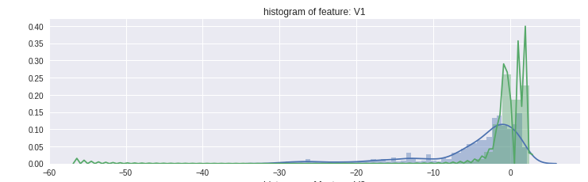
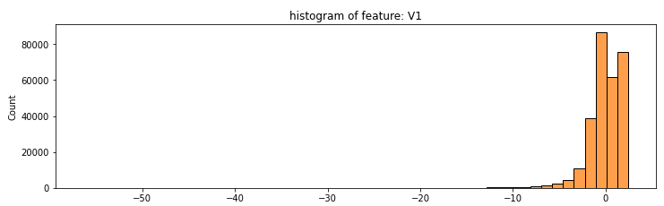

# Kaggle example adapted to run in RHODS sandbox

This document explains how to adapt [the original JH notebook from Kaggle](https://www.kaggle.com/code/currie32/predicting-fraud-with-tensorflow/notebook) to run it in the RedHat Openshift Data Science sandbox. 

### Import section
**Original**
```python
import pandas as pd
import numpy as np 
import tensorflow as tf
from sklearn.cross_validation import train_test_split
import matplotlib.pyplot as plt
from sklearn.utils import shuffle
from sklearn.metrics import confusion_matrix
import seaborn as sns
import matplotlib.gridspec as gridspec
from sklearn.preprocessing import StandardScaler
from sklearn.manifold import TSNE
# from show_confusion_matrix import show_confusion_matrix 
# the above is from http://notmatthancock.github.io/2015/10/28/confusion-matrix.html`
```

**Modified**
```python
import pandas as pd
import numpy as np 
import tensorflow.compat.v1 as tf                         # <-----------
from sklearn.model_selection import train_test_split      # <-----------
import matplotlib.pyplot as plt
from sklearn.utils import shuffle
from sklearn.metrics import confusion_matrix
import seaborn as sns
import matplotlib.gridspec as gridspec
from sklearn.preprocessing import StandardScaler
from sklearn.manifold import TSNE
# from show_confusion_matrix import show_confusion_matrix 
# the above is from http://notmatthancock.github.io/2015/10/28/confusion-matrix.html
```

### Load data

Upload the [original data set](https://drive.google.com/file/d/1X20kRh6GyRPJxHwUami1w8ioJyu1s7G1/view?usp=share_link) into the `./data` folder, then change the code: 

**Original**
```python
df = pd.read_csv("../input/creditcard.csv")
```

**Modified**
```python
df = pd.read_csv("./data/creditcard.csv")
```

### Error `AttributeError: 'DataFrame' object has no attribute 'ix'`
**Original**
```python
#Select only the anonymized features.
v_features = df.ix[:,1:29].columns

plt.figure(figsize=(12,28*4))
gs = gridspec.GridSpec(28, 1)
for i, cn in enumerate(df[v_features]):
    ax = plt.subplot(gs[i])
    sns.distplot(df[cn][df.Class == 1], bins=50)
    sns.distplot(df[cn][df.Class == 0], bins=50)
    ax.set_xlabel('')
    ax.set_title('histogram of feature: ' + str(cn))
plt.show()
```


**Modified**
```python
#Select only the anonymized features.
v_features = df.iloc[:,1:29].columns

plt.figure(figsize=(12,28*4))
gs = gridspec.GridSpec(28, 1)
for i, cn in enumerate(df[v_features]):
    ax = plt.subplot(gs[i])
    sns.histplot(df[cn][df.Class == 1], bins=50)
    sns.histplot(df[cn][df.Class == 0], bins=50)
    ax.set_xlabel('')
    ax.set_title('histogram of feature: ' + str(cn))
plt.show()
```


### Error `AttributeError: 'DataFrame' object has no attribute 'as_matrix'`
**Original**
```python
# Split the testing data into validation and testing sets
split = int(len(y_test)/2)

inputX = X_train.as_matrix()
inputY = y_train.as_matrix()
inputX_valid = X_test.as_matrix()[:split]
inputY_valid = y_test.as_matrix()[:split]
inputX_test = X_test.as_matrix()[split:]
inputY_test = y_test.as_matrix()[split:]
```

**Modified**
```python
# Split the testing data into validation and testing sets
split = int(len(y_test)/2)

inputX = X_train.values
inputY = y_train.values
inputX_valid = X_test.values[:split]
inputY_valid = y_test.values[:split]
inputX_test = X_test.values[split:]
inputY_test = y_test.values[split:]
```


### Error `RuntimeError: tf.placeholder() is not compatible with eager execution.`
**Original**
```python
# Number of input nodes.
input_nodes = 37

# Multiplier maintains a fixed ratio of nodes between each layer.
mulitplier = 1.5 

# Number of nodes in each hidden layer
hidden_nodes1 = 18
hidden_nodes2 = round(hidden_nodes1 * mulitplier)
hidden_nodes3 = round(hidden_nodes2 * mulitplier)

# Percent of nodes to keep during dropout.
pkeep = tf.placeholder(tf.float32)
```

**Modified**
```python
# Number of input nodes.
input_nodes = 37

# Multiplier maintains a fixed ratio of nodes between each layer.
mulitplier = 1.5 

# Number of nodes in each hidden layer
hidden_nodes1 = 18
hidden_nodes2 = round(hidden_nodes1 * mulitplier)
hidden_nodes3 = round(hidden_nodes2 * mulitplier)

tf.disable_v2_behavior()                   # <-------------------------
pkeep = tf.placeholder(tf.float32)
```


### Section: "Visualizing the Data with t-SNE"
**Original**
```python
#reload the original dataset
tsne_data = pd.read_csv("../input/creditcard.csv")
```

**Modified**
```python
#reload the original dataset
tsne_data = pd.read_csv("./data/creditcard.csv")
```

### Error `AttributeError: 'DataFrame' object has no attribute 'ix'`
**Original**
```python
#Scale features to improve the training ability of TSNE.
standard_scaler = StandardScaler()
df2_std = standard_scaler.fit_transform(df2)

#Set y equal to the target values.
y = df2.ix[:,-1].values
```

**Modified**
```python
#Scale features to improve the training ability of TSNE.
standard_scaler = StandardScaler()
df2_std = standard_scaler.fit_transform(df2)

#Set y equal to the target values.
y = df2.iloc[:,-1].values
```

### Error `AttributeError: 'DataFrame' object has no attribute 'ix'`
**Original**
```python
#Scale features to improve the training ability of TSNE.
df_used_std = standard_scaler.fit_transform(df_used)

#Set y_used equal to the target values.
y_used = df_used.ix[:,-1].values
```

**Modified**
```python
#Scale features to improve the training ability of TSNE.
df_used_std = standard_scaler.fit_transform(df_used)

#Set y_used equal to the target values.
y_used = df_used.iloc[:,-1].values
```