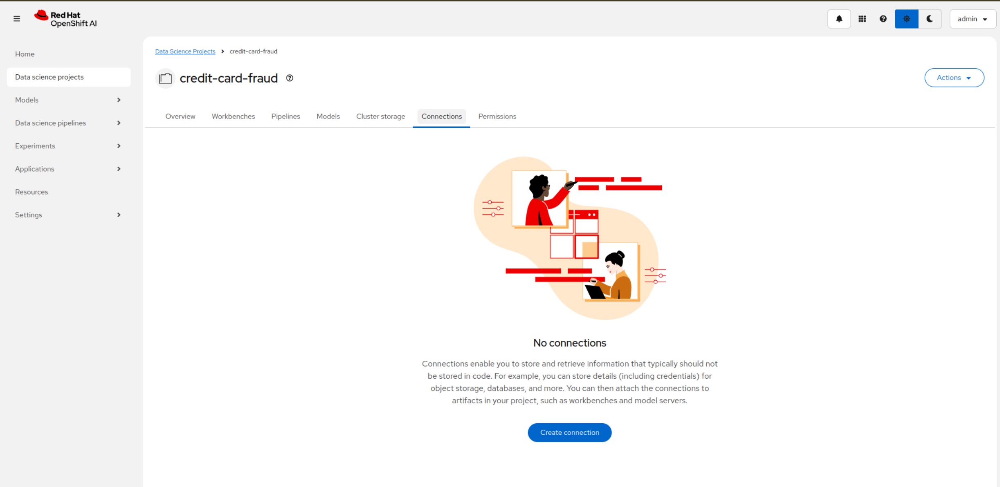
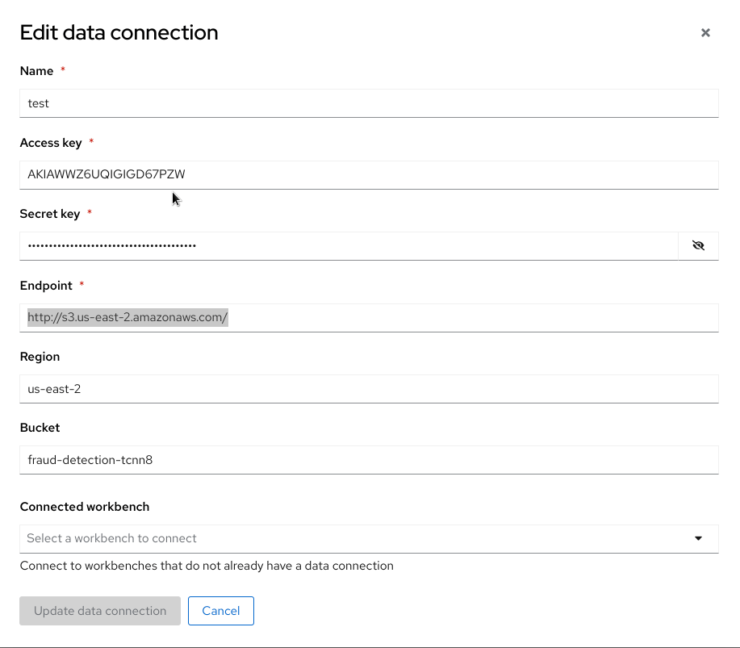
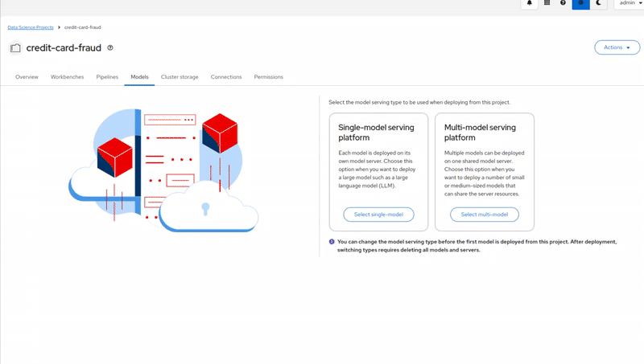

### Create Data connections, configure server and deploy the model
<ol type="a">
<li>Head over to your RHODS ODS dashboard to your Datascience project.</li>

click _Add data connection_ 

Configure the data connection with respective values and click _Add data connection_
Note: the s3 endpoint might be different for your cluster. Usually, it is in the format s3.REGION.amazonaws.com 

<li>Next configure the server and **make sure** to make the route accessible externally.</li>

Click _Configure_ 

<li>Deploy the model to be served</li>

Click _Deploy_ 

Copy the inference link and head back to the [Notebook.ipynb](Notebook.ipynb)
</ol>